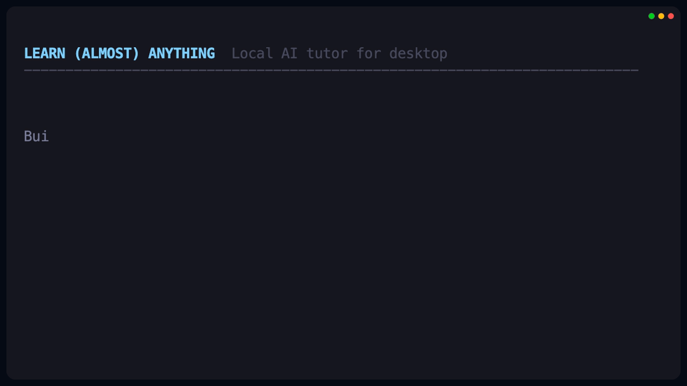

# Learn (Almost) Anything

> Local **AI course generator and personal tutor**: designs personalized courses on any topic, then walks you through them with articles, interactive widgets, comprehension tests, homework with agent review, and TTS lectures. Desktop app for **macOS / Windows**, built on Tauri.

[](https://github.com/legostin/learn-almost-anything/releases)
[](https://github.com/legostin/learn-almost-anything/actions/workflows/release.yml)
[](https://github.com/legostin/learn-almost-anything/releases)
[](https://tauri.app)
[](https://docs.claude.com/en/api/agent-sdk/overview)

> ⚠️ **Free — uses *your* existing subscriptions.** Courses and assignment review are written by Claude Code or the Codex CLI through your **Claude Pro/Max** or **ChatGPT Plus/Pro** subscription — no per-token API spend. Brave Search (free tier) and Gemini API (paid — for image generation and premium TTS) are optional.

<!-- TODO: hero GIF — overview of the feed, opening a submodule, audio -->
<p align="center"></p>

## What it does

- **Courses tailored to you.** A wizard captures goals and background, then an agent designs the curriculum grounded in real syllabi from universities and reputable programs (with live web search — no improvisation from memory).
- **Submodules with interactives.** Article + Mermaid diagrams + images + sandboxed JS widgets (e.g. "a cube in two-point perspective"). A vision pass renders each interactive in headless Chrome and flags broken layouts — they get auto-repaired.
- **"Article first."** Images and the comprehension test backfill in the background; the article becomes readable as soon as the draft is done.
- **Tests and homework.** Every submodule has a comprehension test and a short chain of practical assignments (drawing, written answer, document, .zip with code, GitHub link) with iterative agent review — remarks with criticality, you fix and resubmit until it passes.
- **Lecture audio.** A "Listen" button with a global sticky-footer player and a fullscreen expanded view, ±10s, scrubber. Free engine: built-in OS TTS. Premium: Gemini TTS (pick the model and the voice). WAV chunks are disk-cached so each chunk is paid for at most once.
- **Sharing.** Open a course to a friend over ngrok straight from the app.

<!-- TODO: four GIFs for the main flows -->
<table>
<tr>
<td><br><sub>Course structure + curriculum-design chat</sub></td>
<td><br><sub>Submodule: article + interactives + test</sub></td>
</tr>
<tr>
<td><br><sub>Homework with agent review</sub></td>
<td><br><sub>Audio player: ±10s, scrubber, fullscreen</sub></td>
</tr>
</table>

## Install

Grab a prebuilt binary from the [Releases](https://github.com/legostin/learn-almost-anything/releases) page:

- **macOS** — pick the DMG for your chip: `…_aarch64.dmg` for **Apple Silicon (M1/M2/M3/M4)**, `…_x64.dmg` for **Intel**. Signed with a Developer ID certificate and notarized by Apple — opens with a double-click, no Gatekeeper bypass needed.
- **Windows** — `.msi` / `.exe` for x64. Unsigned: SmartScreen will warn — click "More info" → "Run anyway".

The UI starts in English; switch to Russian in Settings if you prefer.

## What else you need

1. **Node.js** (≥ 20) — the sidecar runs the agents via Node.
2. **One agent** (with an active subscription):

   | Agent | Subscription | Install |
   |---|---|---|
   | **Claude Code CLI** | Claude Pro / Max | `npm i -g @anthropic-ai/claude-code` → `claude login` |
   | **Codex CLI** | ChatGPT Plus / Pro | `npm i -g @openai/codex` → `codex login` |

   You can install both and pick the backend per course.

3. **Optional** (set in app Settings, stored locally):

   - **Brave Search API key** — free tier ~2 000 req/month. Powers image and web search for illustrations. <https://brave.com/search/api>
   - **Gemini API key** — **paid** per Google's pricing. Enables: (a) custom illustration generation (Nano Banana / Nano Banana Pro), (b) premium TTS for the lecture player with model + voice selection. <https://aistudio.google.com/apikey>

It still works without either: courses and assignment review go through your subscription, web grounding through the agent's built-in `WebSearch`, audio through the OS TTS voice.

## Develop

```bash
git clone https://github.com/legostin/learn-almost-anything.git
cd learn-almost-anything

pnpm install
pnpm --dir sidecar install

pnpm tauri dev
```

Requires: **Rust** (stable), **pnpm**, **Node 20+**.

While dev'ing, if you want the share flow to reflect your latest UI changes:

```bash
pnpm build:watch    # keeps dist/ in sync with the source for the embedded share HTTP server
```

## Build locally

```bash
pnpm tauri build
```

Artifacts land in `src-tauri/target/release/bundle/`. Before bundling, `scripts/copy-sidecar.mjs` copies the sidecar (with its `node_modules`) into `src-tauri/sidecar/` so `bundle.resources` picks it up.

## Architecture (brief)

- **Tauri 2** (Rust + system WebView) — shell, windows, IPC.
- **React 19 + TypeScript + Vite** — frontend.
- **Node sidecar** — every agent call goes through `@anthropic-ai/claude-agent-sdk` or `@openai/codex-sdk`. The sidecar runs isolated: `settingSources: []`, `permissionMode: "dontAsk"`, so the host's other MCPs don't leak in.
- **SQLite (rusqlite)** — local store for courses and state. Content (articles, widgets, tests, homework, chats) lives as files under `app_data_dir`.
- **Playwright-core + system Chrome** — renders interactive widgets for visual review (no Chromium download).
- **MCP servers** — Brave Search included; launched locally to skip the per-call `npx` resolve.

## License

Not set (personal project). Source is open for reading and personal use; use at your own risk.
