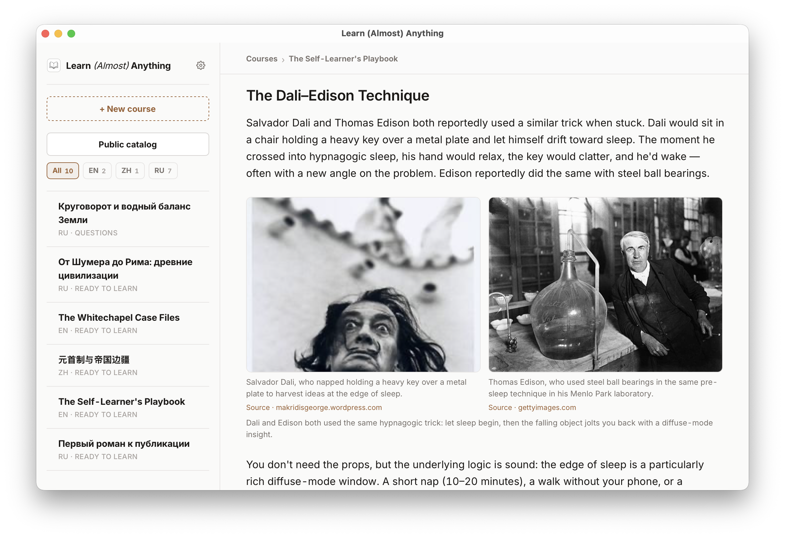
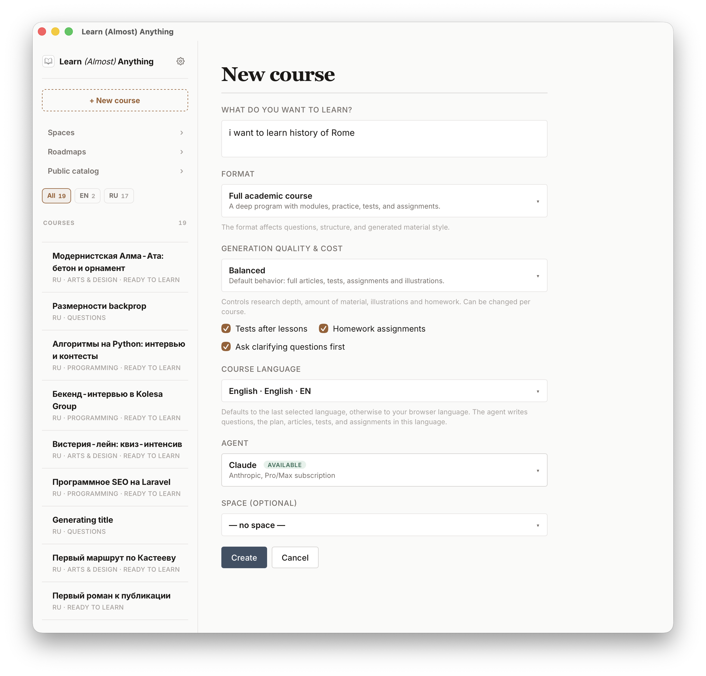
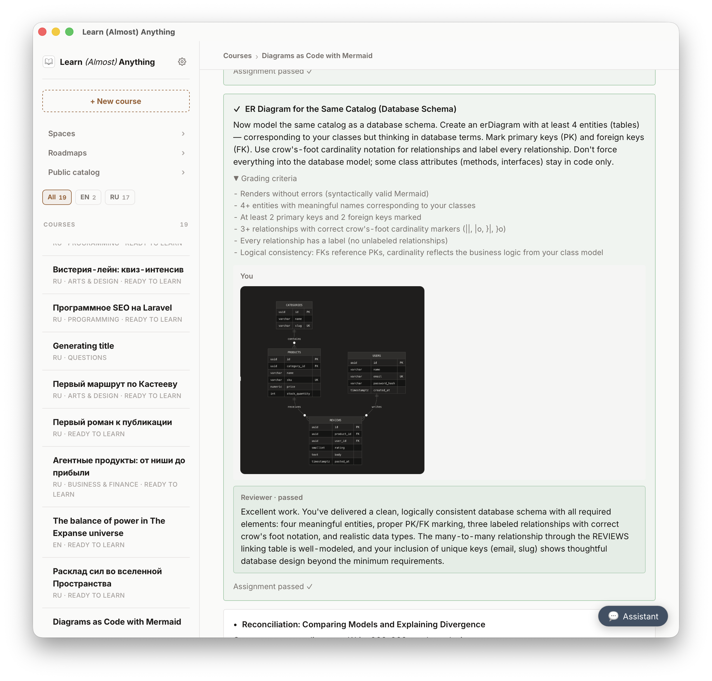
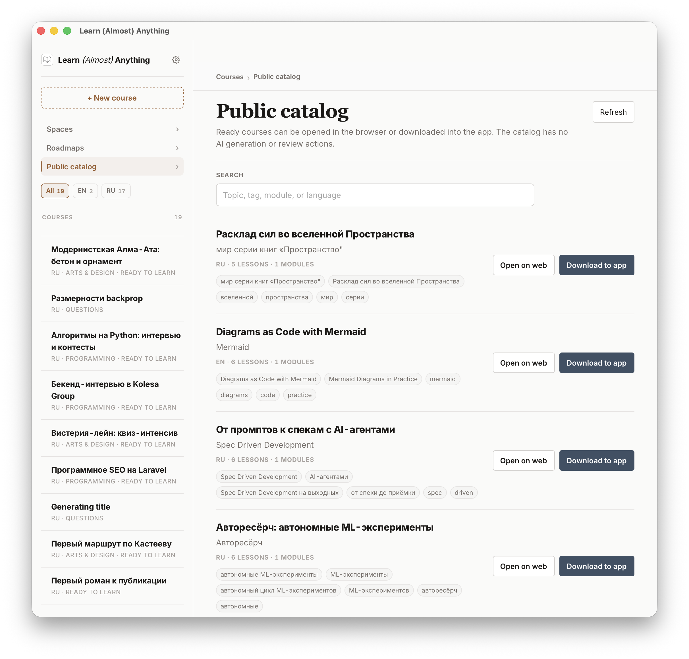
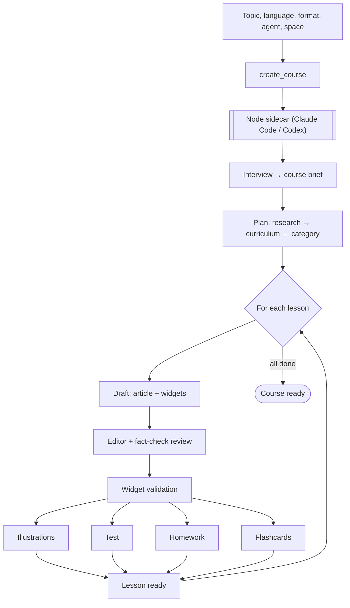

# Learn (Almost) Anything

> Type a topic. Get a real course — with lessons, diagrams, tests, homework and spaced review — built by the AI subscription you already pay for, stored on your own machine.

[](https://github.com/legostin/learn-almost-anything/releases)
[](https://github.com/legostin/learn-almost-anything/actions/workflows/release.yml)
[](https://github.com/legostin/learn-almost-anything/releases)
[](https://tauri.app)
[](#your-subscription-is-the-engine)

<p align="center"></p>

## Why this exists

Everyone "learns with ChatGPT" now — and a week later all that's left is a chat transcript you'll never reopen. Chats answer questions; they don't teach. Real learning needs structure, practice, feedback and repetition.

Learn (Almost) Anything turns "I want to understand X" into an actual course: an agent interviews you, researches the topic, designs a curriculum, writes illustrated lessons, quizzes you, grades your homework, and schedules flashcard reviews so the material sticks. Everything lives on your disk. There's no platform, no subscription of ours, no server with your data — the engine is the Claude Code or Codex CLI you already have.

It's the difference between asking a smart friend questions all evening and having that friend sit down and *teach you properly*.

## What it looks like

<!-- TODO: скриншот — главный экран с библиотекой курсов на разных языках (в screens/ пока нет отдельного скрина главной) -->

You pick a topic, language, format and agent. The course can be a full academic course, a compact mini-module, a podcast-style series, a single lesson — or a roadmap that maps the whole journey first.

<p align="center"></p>

## The full learning loop

Most AI tools stop at "here's some text". This one closes the loop:

- **Lessons that look like lessons** — articles with real sourced images, Mermaid diagrams, galleries and sandboxed interactive widgets. Every draft goes through an editor/fact-check pass before you see it.
- **Comprehension tests** — question pools that check understanding, not verbatim recall, and interleave concepts from earlier modules.
- **Real homework** — essays, diagrams, file uploads, GitHub repos, and autograded coding tasks that actually run your code. The agent reviews submissions and makes you retry until it passes.
- **Spaced repetition** — flashcards are extracted from each lesson and scheduled for review, so the course keeps working on you after you've read it.
- **Lecture audio** — free OS voices out of the box, optional premium Gemini TTS, cached on disk.

<p align="center"></p>

Don't want the full treatment? Checkboxes at creation turn tests and homework off, and you can skip the clarifying interview entirely — title, plan, go.

## Roadmaps: see the whole journey

For big goals ("become a data engineer", "learn academic painting from zero") a single course is the wrong shape. A roadmap lays out stages and skills, runs a quick diagnostic to find out what you already know, and spawns a lesson or a full course from any skill — each one aware of where it sits in the bigger picture.

<!-- TODO: скриншот — роудмап с этапами и навыками (в screens/ пока нет) -->

## Your materials, your sources

Drop documents, links and folders into a **Space** and courses created there ground themselves in *your* material — strictly (only your sources) or openly (your sources first, the web second). Attach custom MCP servers to a course and the agent can research through any tool you trust.

## Private catalogs for teams

This is the part companies asked for. Spin up your own catalog server **inside your infrastructure** — one Docker command, hidden from the public internet:

```bash
docker run -d -p 8080:8080 \
  -e PUBLIC_ORIGIN=http://catalog.internal.example.com:8080 \
  -e CATALOG_UPLOAD_TOKEN=your-secret \
  -v laa-catalog-data:/data \
  legostin/laa-catalog:latest
```

Everyone on the team adds the URL in Settings and gets a shared internal course library: onboarding tracks, domain knowledge, tooling guides. Authors publish with the team token; everyone else browses, installs and pulls updates with no token at all. Courses remember which catalog they came from, so update checks keep working even across reconfigurations. The public catalog stays available alongside.

<p align="center"></p>

And of course: publish your best courses to the [public catalog](https://catalog.almost-anything.io), install other people's courses, translate any course into another language — structure, lessons, tests, homework, diagram labels and even baked-in image text included.

## Your subscription is the engine

The app is free and runs no paid backend. Every LLM call goes through an agent CLI **already installed and authenticated on your machine**:

| You have | It powers | Install |
|---|---|---|
| Claude Pro / Max | Claude Code CLI | `npm i -g @anthropic-ai/claude-code` → `claude login` |
| ChatGPT / Codex plan | Codex CLI | `npm i -g @openai/codex` → `codex login` |

Install both and pick per course. Optional extras, each off by default: Brave Search API (web/image grounding), Gemini API (generated illustrations, premium TTS). A quality/cost tier per course (quick / balanced / premium) controls research depth, reasoning effort and how much material gets generated — so a quick mini-course stays cheap and a premium deep-dive goes all in.

Provider pricing changes; check [Claude Code plans](https://support.claude.com/en/articles/11145838-using-claude-code-with-your-pro-or-max-plan), [Codex pricing](https://chatgpt.com/codex/pricing/), [Gemini API](https://ai.google.dev/gemini-api/docs/pricing), [Brave Search API](https://brave.com/search/api/).

## Get started

1. **Download** the latest build from [Releases](https://github.com/legostin/learn-almost-anything/releases) — macOS `.dmg` (Apple Silicon / Intel, signed and notarized) or Windows `.msi`/`.exe` (unsigned for now, SmartScreen may warn).
2. **Make sure Node.js 20+ is installed** — the local sidecar runs the agent SDKs through it.
3. **Have at least one agent CLI** logged in (table above), then launch the app and create your first course.

The UI ships in English and Russian; course content can be generated in any language you pick — a single library happily mixes English, Russian and Chinese courses.

Installed builds self-update: the app checks GitHub Releases, downloads a signed updater bundle, verifies and installs it.

## How it works under the hood

<details>
<summary>The generation pipeline (click to expand)</summary>

You pick one agent (Claude or Codex) when creating the course; every LLM step then runs through it via a local Node sidecar:

1. **Interview** — a few adaptive clarifying questions become the course brief (skippable).
2. **Plan** — the agent researches (web / Context7 / MediaWiki / arXiv / OpenAlex / your Space), designs the module tree and classifies the subject category.
3. **Per-lesson generation** — draft (article + widgets) → editor & fact-check review → widget validation; then illustrations (real image vs code snippet, per block), a test, homework and flashcards in parallel. Accuracy-critical categories get an extra background fact-check pass.



</details>

**Stack:** Tauri 2 (desktop shell) · React 19 + TypeScript + Vite · Node sidecar calling `@anthropic-ai/claude-agent-sdk` and `@openai/codex-sdk` · SQLite + files for local storage · Playwright + system Chrome for visual widget checks · bundled MCP servers for controlled research tools.

## Local data and privacy

- Courses, progress and media live in the local app data directory. No Learn server hosts your content.
- Agent providers receive only the prompts and course context needed for generation; optional Gemini/Brave integrations receive only the requests for features you enabled.
- Catalog publishing and ngrok sharing happen only when you explicitly trigger them.

## Latest releases

- **v0.3.0** — private self-hosted catalogs (Docker image + multi-server support in the app), tests/homework toggles and a skippable interview at course creation, multiline topic input.
- **v0.2.0** — single lessons, roadmaps, runnable autograded code assignments, custom MCP servers.
- **v0.1.x** — public catalog, course formats, signed in-app updates, richer lesson visuals.

## Develop

```bash
git clone https://github.com/legostin/learn-almost-anything.git
cd learn-almost-anything

pnpm install
pnpm --dir sidecar install

pnpm tauri dev
```

Requires Rust stable, pnpm, and Node 20+. `pnpm tauri build` produces bundles under `src-tauri/target/release/bundle/`; for local browser/share testing keep the frontend build current with `pnpm build:watch`.

The catalog server lives in a separate repository and ships as the `legostin/laa-catalog` Docker image; the app talks to `https://catalog.almost-anything.io` by default and to any private servers you add.

## License

Not set. Source is open for reading and personal use; use at your own risk.

---

More utilities by the author: [legost.in](https://legost.in/en/utilities)
